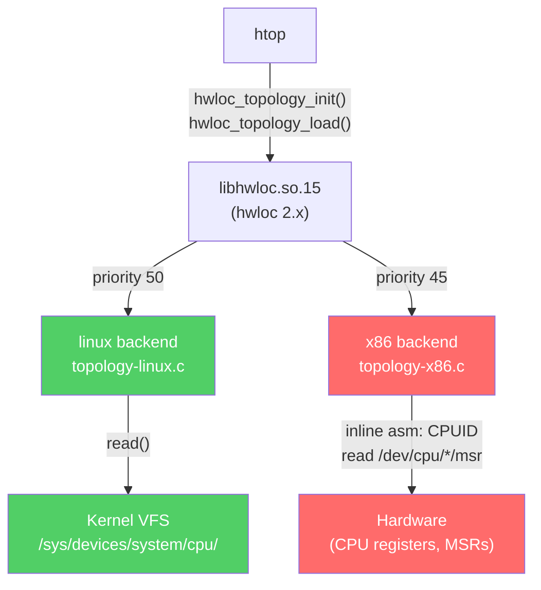
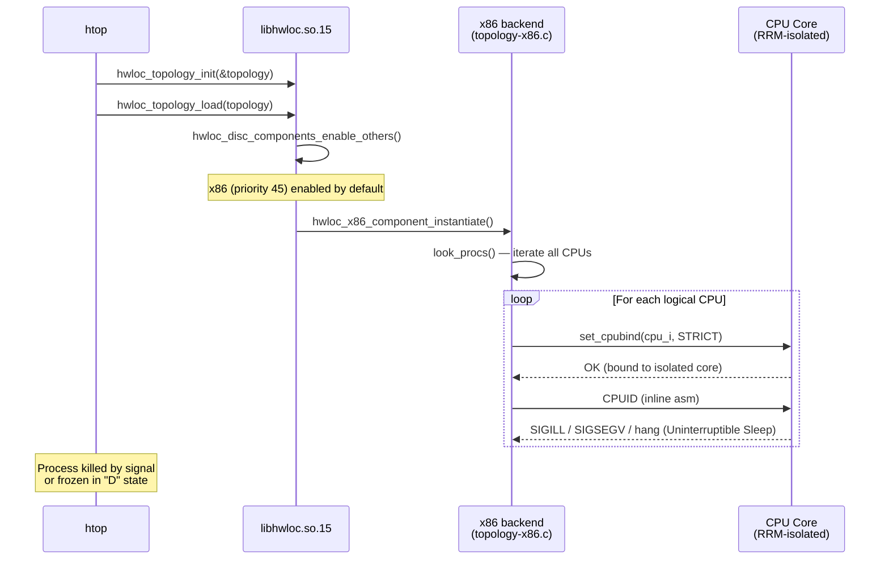

# Why htop Hangs After Redline RRM — A Code-Level Root Cause Analysis

## 1. Problem Statement

On trading servers running Redline Realtime Manager (RRM), `htop` hangs on startup — but only if launched **after** RRM. This issue is a significant regression observed during RHEL 9 migrations; the same configuration worked reliably on RHEL 7.

The hang is not limited to `htop`. Any tool using `libhwloc` for hardware discovery is affected, including:
- `lstopo` (topology visualization)
- `mpirun` / `orterun` (Open MPI process launchers)
- High-performance computing (HPC) schedulers

The standard workaround is a single environment variable:

```bash
export HWLOC_COMPONENTS=-x86
```

This article traces the issue from `htop`'s process entry through `libhwloc`'s component system down to the inline assembly instruction that faults, explains why the RHEL 9 environment triggers this failure, and shows exactly how the environment variable disables the offending code path.

## 2. Software Stack



The red path hangs on startup under RRM. The green path is safe — it reads virtual files only.

## 3. Why Priority Matters

`hwloc` sorts its discovery components by priority and executes them in descending order. This determines whether a backend **creates** the topology or simply **enriches** it.

| Component | Priority | Role in Discovery |
|---|---|---|
| **linux** | **50** | **Primary.** Creates the base topology by reading `/sys` and `/proc`. Because it is "Native OS" priority, it runs first and is generally safe. |
| **x86** | **45** | **Augmenting.** Runs *after* the OS backend. Its job is to "fill in the blanks" (like L1/L2 cache relationships) by talking directly to the silicon. |

The hang occurs because the x86 backend (45) does not stop just because the Linux backend (50) succeeded. It proceeds to bind a thread to every isolated core and execute `CPUID` to "improve" the data it already has. By the time it reaches the x86 phase, the environment is already "poisoned" by RRM, leading to the hang.

## 4. hwloc Discovery Architecture

hwloc uses a **component-based plugin system** with priority ordering. Each discovery component registers a struct declaring its name, phase, and priority. During `hwloc_topology_load()`, components are instantiated in priority order (highest first) and each runs its discovery phase.

The x86 backend registers itself in [`topology-x86.c`](https://github.com/open-mpi/hwloc/blob/master/hwloc/topology-x86.c) at line ~1622:

```c
static struct hwloc_disc_component hwloc_x86_disc_component = {
  "x86",                              /* name */
  HWLOC_DISC_PHASE_CPU,               /* phases */
  HWLOC_DISC_PHASE_GLOBAL,            /* excluded phases */
  hwloc_x86_component_instantiate,    /* instantiate callback */
  45,                                  /* priority: between native (50) and no_os (40) */
  1,                                   /* enabled_by_default */
  NULL
};
```

**Priority 45** means the x86 backend runs after the linux/sysfs backend (priority 50). Because `enabled_by_default` is `1`, it will always be loaded unless explicitly excluded.

### What the x86 backend does

The discovery entry point `look_procs()` (line ~1298) iterates over every logical processor and **binds the calling thread to each CPU** before executing CPUID:

```c
for (i = 0; i < nbprocs; i++) {
    hwloc_bitmap_only(set, i);
    if (set_cpubind(topology, set, HWLOC_CPUBIND_STRICT)) {
      hwloc_debug("could not bind to CPU%u: %s\n", i, strerror(errno));
      continue;
    }
    look_proc(backend, &infos[i], flags, highest_cpuid,
              highest_ext_cpuid, features, cpuid_type, ...);
}
```

Once bound, it calls `hwloc_x86_cpuid()` — an inline assembly wrapper in [`include/private/cpuid-x86.h`](https://github.com/open-mpi/hwloc/blob/master/include/private/cpuid-x86.h) (line ~65) that fires the `CPUID` instruction directly on the silicon:

```c
static __hwloc_inline void hwloc_x86_cpuid(unsigned *eax, unsigned *ebx,
                                            unsigned *ecx, unsigned *edx)
{
#ifdef __x86_64__
  /* rbx is special in x86-64 ABI — save and restore */
  asm(
    "xchgq %%rbx,%q1\n"
    "cpuid\n"
    "xchgq %%rbx,%q1\n"
    : "=a" (*eax), "=&r" (*ebx), "=c" (*ecx), "=d" (*edx)
    : "0" (*eax), "2" (*ecx));
#endif
}
```

This probes cache topology (CPUID leaves 0x02, 0x04), thread/core hierarchy (leaf 0x0B/0x1F), and extended features — all by executing privileged-adjacent instructions directly on the CPU.

In `libhwloc` 2.x, the x86 backend also attempts to read Model-Specific Registers (MSRs) via `/dev/cpu/*/msr` to determine:
- **Package-level power limits** (RAPL)
- **Actual vs. Nominal clock speeds** (APERF/MPERF)

While this provides richer data for `htop`, these registers are strictly protected under RRM/Lockdown environments.

## 5. What RRM Does at the Hardware Level

Redline Realtime Manager achieves zero-jitter execution for trading engines by fundamentally altering the operating environment of isolated cores:

| RRM Action | Mechanism | Effect on hwloc |
|---|---|---|
| **Core isolation** | `isolcpus=` boot param + cgroup cpusets | `sched_setaffinity()` to isolated core fails or succeeds but thread is immediately preempted |
| **MSR lockdown** | Restricts `/dev/cpu/*/msr` file access | `open()` on MSR device returns `EACCES` or `ENXIO` |
| **Interrupt shielding** | Masks IRQ delivery; redirects NMI | CPU may not service page faults or signals during CPUID execution |
| **Scheduler bypass** | Removes cores from CFS run queue | Kernel cannot migrate or preempt threads on isolated cores in a controlled way |

The critical conflict: hwloc's `look_procs()` loop binds to **every** logical CPU — including those RRM has isolated. When it calls `set_cpubind()` with `HWLOC_CPUBIND_STRICT` on an RRM-managed core, the subsequent `CPUID` execution hits a core that may have:
- Restricted MSR access (fault on RDMSR used alongside CPUID)
- Disabled interrupt delivery (thread hangs — no signal can kill it)
- Modified CPU state that makes topology enumeration return garbage or trap

## 6. Root Cause: The Hang Sequence



### Why launching htop *before* RRM works

When `htop` starts first, `hwloc_topology_load()` completes its full silicon probe across all cores while they are still in normal operating mode. The topology is cached in the `hwloc_topology` struct in process memory. By the time RRM locks down cores, `htop` is in its main loop reading `/proc/stat` for CPU utilization — it never calls `hwloc_topology_load()` again.

## 7. The Fix: Tracing Through `components.c`

The environment variable `HWLOC_COMPONENTS=-x86` is processed in [`hwloc_disc_components_enable_others()`](https://github.com/open-mpi/hwloc/blob/master/hwloc/components.c#L917) in `components.c`.

### Constants (line 13-15)

```c
#define HWLOC_COMPONENT_STOP_NAME "stop"
#define HWLOC_COMPONENT_EXCLUDE_CHAR '-'
#define HWLOC_COMPONENT_SEPS ","
```

### Parsing flow

```c
_env = getenv("HWLOC_COMPONENTS");          /* line 923 */
env = _env ? strdup(_env) : NULL;            /* line 924 — duplicate since we modify it */
```

The function uses a **two-pass parse** over the comma-separated tokens:


**With `HWLOC_COMPONENTS=-x86`:**

1. **Pass 1** finds token `-x86`. The `'-'` prefix triggers `hwloc_disc_component_blacklist_one("x86")`, which marks the x86 component as excluded. The token characters are overwritten with commas so Pass 2 skips them.
2. **Pass 2** finds no remaining tokens. `tryall` stays `1`.
3. **Default loading** iterates all registered components but skips `"x86"` because it is blacklisted.
4. The linux/sysfs backend (priority 50) becomes the highest-priority CPU discovery component. It reads topology from `/sys/devices/system/cpu/` — virtual files served by the kernel, requiring no privileged CPU instructions.

## 8. Why This Only Appears on RHEL 9 (Not RHEL 7)

This hang is a RHEL 9 regression — the same RRM configuration worked fine on RHEL 7. Three changes between RHEL 7 and RHEL 9 stack together to turn a benign race into a hard hang.

### 8a. hwloc 1.11 → 2.4 (the biggest factor)

| | RHEL 7 | RHEL 9 |
|---|---|---|
| **hwloc package** | 1.11.8 (`libhwloc.so.5`) | 2.4.1 (`libhwloc.so.15`) |
| **x86 backend** | Simpler — probed local core's CPUID, relied on linux/sysfs for remote cores | Rewritten — `look_procs()` **binds to every logical CPU** and executes CPUID on each one |
| **Strict binding** | Used less aggressively in discovery | `set_cpubind(HWLOC_CPUBIND_STRICT)` — hard-fails if bind is denied |

hwloc 2.x significantly rewrote the x86 discovery backend. In 1.11.x, the x86 component was simpler and fell back gracefully. In 2.x, the `look_procs()` loop at line ~1322 explicitly iterates every logical CPU with strict binding — this is the code path that hangs on RRM-isolated cores.

Verify on your RHEL 9 box:

```bash
# Check the hwloc library version
hwloc-info --version
# Output: hwloc-info 2.x.x

# Check the dynamic links of htop
ldd $(which htop) | grep hwloc
# Should show libhwloc.so.15 → hwloc 2.x
```

### 8b. Kernel Lockdown LSM (new in RHEL 9)

RHEL 9 ships with the [Kernel Lockdown LSM](https://www.man7.org/linux/man-pages/man7/kernel_lockdown.7.html) enabled by default (not present in RHEL 7). When Secure Boot is active or lockdown is set to `integrity` mode, **direct MSR access is restricted**:

> "modifying of x86 MSR registers is restricted" — `kernel_lockdown(7)`

This means:
- **RHEL 7**: hwloc could read MSRs via `/dev/cpu/*/msr` even on cores RRM was managing — it might get stale data but wouldn't hang.
- **RHEL 9**: The lockdown LSM denies MSR reads entirely. While `libhwloc` tries to handle `EACCES` gracefully, the combination of aggressive CPU binding and restricted register access can trigger a signal or process hang if the kernel LSM implementation is not expecting a discovery loop on an isolated core.

Check your lockdown state:

```bash
cat /sys/kernel/security/lockdown
# [none] integrity confidentiality
```

### 8c. cgroup v2 (RHEL 9 default) vs cgroup v1 (RHEL 7)

| | RHEL 7 | RHEL 9 |
|---|---|---|
| **cgroups** | v1 (hybrid) | v2 (unified, default) |
| **cpuset behavior** | Permissive — `sched_setaffinity()` to an isolated core often silently succeeds | Stricter — unified hierarchy enforces cpuset boundaries, `sched_setaffinity()` returns `EINVAL` |

Under cgroup v2, if RRM has placed isolated cores into a restricted cpuset, hwloc's `set_cpubind(cpu_i, HWLOC_CPUBIND_STRICT)` is more likely to fail hard rather than silently succeed. hwloc 2.x treats this strict bind failure differently than 1.x — depending on the code path, it may not handle the error gracefully.

### Summary: Three layers of forgiveness removed

On RHEL 7, three layers of forgiveness worked in your favor:

1. **hwloc 1.11** didn't aggressively bind-and-probe every core
2. **No kernel lockdown** — MSR access silently worked even if data was stale
3. **cgroup v1** was permissive about cross-cpuset affinity calls

On RHEL 9, all three tightened simultaneously — hwloc 2.x probes harder, lockdown blocks MSR access, and cgroup v2 enforces stricter CPU affinity — turning what was a benign race into a hang.

## 9. Code References

| Component | File | Key Function | Link |
|---|---|---|---|
| Component parsing | `hwloc/components.c` | `hwloc_disc_components_enable_others()` | [components.c#L917](https://github.com/open-mpi/hwloc/blob/master/hwloc/components.c#L917) |
| x86 CPUID wrapper | `include/private/cpuid-x86.h` | `hwloc_x86_cpuid()` | [cpuid-x86.h](https://github.com/open-mpi/hwloc/blob/master/include/private/cpuid-x86.h) |
| x86 topology probe | `hwloc/topology-x86.c` | `look_procs()`, `hwloc_look_x86()` | [topology-x86.c](https://github.com/open-mpi/hwloc/blob/master/hwloc/topology-x86.c) |
| x86 component registration | `hwloc/topology-x86.c` | `hwloc_x86_disc_component` struct | [topology-x86.c#L1622](https://github.com/open-mpi/hwloc/blob/master/hwloc/topology-x86.c#L1622) |
| htop hwloc usage | `linux/Platform.c` | `hwloc_topology_init()` / `hwloc_topology_load()` | [htop repo](https://github.com/htop-dev/htop) |
| Original issue | GitHub | Discussion of `-x86` workaround | [hwloc#474](https://github.com/open-mpi/hwloc/issues/474) |

## 10. Operational Recommendation

On any server where Redline RRM (or similar core-isolation software) manages CPU resources, add this to the shell profile or systemd unit for monitoring tools:

**Shell profile** (`~/.bashrc` or `/etc/profile.d/hwloc-rrm.sh`):
```bash
export HWLOC_COMPONENTS=-x86
```

**systemd unit override** (e.g., for a monitoring service):
```ini
[Service]
Environment="HWLOC_COMPONENTS=-x86"
```

This disables hwloc's direct silicon probing across all tools that link against `libhwloc` — not just `htop`, but also `lstopo`, Open MPI, and any other hwloc consumer. The linux/sysfs backend provides identical topology information for monitoring purposes; the only lost capability is CPUID-level cache detail that the kernel already exposes via sysfs on modern kernels (4.x+).

### Alternative: XML Topology
For users who still want high-detail topology visualization but need to avoid the live hardware probe, `libhwloc` can load a static XML topology file:

1. **Generate the XML** once (e.g., during system boot or before starting RRM):
   ```bash
   lstopo-no-graphics topology.xml
   ```
2. **Load the XML** for subsequent tool calls:
   ```bash
   export HWLOC_XMLFILE=topology.xml
   # OR use the --input flag with lstopo
   lstopo --input topology.xml
   ```
This avoids the x86 backend discovery loop entirely while preserving full cache and socket details.
